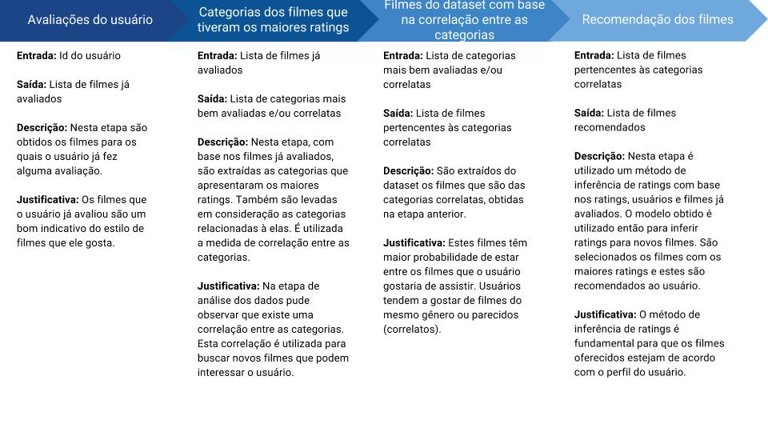

# **Sistema de Recomendação de Filmes**

Os objetivos destes projeto são:

* Explorar o dataset [ml-latest-small](http://files.grouplens.org/datasets/movielens/ml-latest-small.zip).
* Verificar se existe relação entre as categorias dos filmes.
* Verificar se existe relação entre os ratings e as categorias dos filmes.
* Construir um sistema de recomendação tendo como entrada o id do usuário. A saída deve ser um conjunto de filmes recomendados.
* Apresentar detalhadamente o pipeline da solução proposta.

### **Introdução**

Sistemas de recomendação são amplamentes conhecidos e utilizados em diversas aplicações. Estes sistemas tem como objetivo principal indicar produtos/serviços/conteúdos com base em perfis ou características de produtos já conhecidos. Neste sentido, os sistemas de recomendação podem ser divididos em dois tipos:
- filtragem colaborativa;
- filtragem baseada em conteúdo.

A filtragem colaborativa consiste na utilização de informações provenientes de comportamentos, atividades e preferências e, consequentemente, a análise de similaridade com outros usuários. Tendo como base esta análise comportamental são indicados novos produtos e serviços. A base para estas recomendações é que usuários que têm gostos similares tem grande probabilidade de concordar em recomendações futuras. Em outras palavras, os sistemas de recomendação baseados em filtragem colaborativa são construídos com base no comportamento dos usuários e suas similaridades. Um exemplo clássico deste tipo de recomendação é a sugestão de filmes tendo como base o perfil de cada usuário, os filmes já asssistidos e os ratings fornecidos pelos mesmos. 

Os sistemas de recomendação baseados em conteúdo buscam conhecer os produtos e serviços que serão objeto de recomendações. Por exemplo, para recomendação de filmes com base no conteúdo são analisadas as categorias de cada filme, o estilo, os atores e diretores e etc. Neste tipo de recomendação o foco é o conteúdo e suas características. Estes sistemas tem como premissa que o usuário irá gostar de novos produtos e serviços similares ao filmes que receberam altos ratings anteriormente.

Além disso, existem os sistemas híbridos que combinam características das recomendações colaborativas e dos sistemas baseados em conteúdo para obter melhores resultados.

### **Problema**
O problema que será abordado neste projeto é a recomendação de filmes, ou seja, tendo como base um conjunto de características de usuários e/ou filmes recomendar novos itens que ainda não foram assistidos pelos usuários.

Existem duas abordagens principais para a construção de sistemas de recomendação, como descrito na seção anterior. O primeiro tipo, chamado de filtragem colaborativa, demanda o uso de informações provenientes dos usuários. Desta forma, espera-se analisar informações comportamentais dos usuários como os filmes já assistidos, ratings dados pelo usuários e outras informações que permitam analisar similaridade entre os usuários. Já os sistemas de recomendação com base no conteúdo tem como objetivo analisar as caractarísticas dos filmes como, por exemplo, categorias, tags, diretores, elenco, relação entre as categorias e etc. Desta forma, como descrito anteriormente, o foco deste segundo tipo de abordagem está no conhecimento do filme que será recomendado. Uma terceira abordagem pode ainda combinar características das duas abordagens anteriores tendo uma solução mista. 

O sistema de recomendação, como apresentado na imagem abaixo, tem como entrada um identificador único do usuário para o qual serão feitas recomendações de novos filmes. Na segunda etapa é construída a solução de recomendação tendo como base as informações disponíveis no dataset. Estas informações podem ser sobre os filmes e/ou sobre os usuários. A solução pode seguir um dos três tipos de sistema de recomendação: filtragem colaborativa, sistemas baseados em conteúdo ou solução mista.   

### **ML-Latest-Small - Dataset**
O dataset [ml-latest-small](http://files.grouplens.org/datasets/movielens/ml-latest-small.zip) que será utilizado neste projeto foi obtido no site [Grouplens](https://grouplens.org/) mantido pelo Departamento de Ciência da Computação e Engenharia da Universidade de Minnesota, EUA.

Este dataset é composto de informações obtidas no site [Movielens](https://movielens.org/) que tem como objetivo recomendar filmes para os usuários. Existem duas versões do dataset. A primeira delas é destinada a pesquisas acadêmicas e a segunda para desenvolvimento e ensino. Por uma questão de poder computacional, será utilizada a versão reduzida do dataset destinado à ensino. Este é composto de aproximadamente 100 mil ratings, 1300 tags, 9 mil filmes avaliados por 700 usuários.

#### **Dados Disponíveis**
Para formular uma solução para o problema devemos analisar as infoormações disponíveis no dataset a partir do qual o sistema de recomendação será desenvolvido. O conjunto de dados disponíveis neste dataset estão organizados em 4 tabelas (.csv): links, movies, ratings, e tags. As features presentes em cada uma das tabelas são:

- Filmes: movieId, title, genres;
    - Total de 9125 filmes 
    - Amostra dos dados:

|   | movieId |                              title |                                      genres |
|:-:|:-------:|-----------------------------------:|--------------------------------------------:|
| 0 |    1    |                   Toy Story (1995) | Adventure|Animation|Children|Comedy|Fantasy |
| 1 |    2    |                     Jumanji (1995) |                  Adventure|Children|Fantasy |
| 2 |    3    |            Grumpier Old Men (1995) |                              Comedy|Romance |
| 3 |    4    |           Waiting to Exhale (1995) |                        Comedy|Drama|Romance |
| 4 |    5    | Father of the Bride Part II (1995) |                                      Comedy |

- Ratings: userId, movieId, rating, timestamp;
    - Total de 100.004 ratings 
    - Amostra dos dados:

|   | userId | movieId | rating | timestamp  |
|:-:|:------:|:-------:|-------:|------------|
| 0 |    1   |    31   |    2.5 | 1260759144 |
| 1 |    1   |   1029  |    3.0 | 1260759179 |
| 2 |    1   |   1061  |    3.0 | 1260759182 |
| 3 |    1   |   1129  |    2.0 | 1260759185 |
| 4 |    1   |   1172  |    4.0 | 1260759205 |

- Tags: userId, movieId, tag, timestamp;
    - Total de 1296 tags
    - Amostras dos dados:

|   | userId | movieId |                     tag | timestamp  |
|:-:|:------:|:-------:|------------------------:|------------|
| 0 |   15   |   339   | sandra 'boring' bullock | 1138537770 |
| 1 |    1   |   1029  |                 dentist | 1193435061 |
| 2 |   15   |   7478  |                Cambodia | 1170560997 |
| 3 |   15   |  32892  |                 Russian | 1170626366 |
| 4 |   15   |  34162  |             forgettable | 1141391765 |

- Links: movieId, imdbId, tmdbId;
    - Total de 9125 links
    - Amostra dos dados:

|   | movieId | imdbId |  tmdbId |
|:-:|:-------:|:------:|--------:|
| 0 |    1    | 114709 |   862.0 |
| 1 |    2    | 113497 |  8844.0 |
| 2 |    3    | 113228 | 15602.0 |
| 3 |    4    | 114885 | 31357.0 |
| 4 |    5    | 113041 | 11862.0 |

### **Solução Proposta**
A solução proposta para este projeto leva em consideração as informações disponíveis no dataset [ml-latest-small](http://files.grouplens.org/datasets/movielens/ml-latest-small.zip), como apresentado na seção anterior.

O método proposto para o sistema de recomendação de filmes consiste em 4 etapas que compreendem desde a análise dos filmes assistidos pelo usuário até a saída com uma lista de filmes recomendados. A figura a seguir apresenta uma visão geral da solução.

A primeira etapa da solução, chamada de "Avaliação do usuário", consiste em processar a lista de filmes que o usuário já assistiu e avaliou. Esta lista representa um bom indicativo do perfil de filmes que estão dentro das preferências do usuário. Dentre os filmes avaliados, podemos inferir também aqueles estilo que o usuário não gosta, representados pelos ratings mais baixos dados por este usuário.

A segunda etapa consiste em avaliar a lista de filmes obtida na primeira etapa, extraindo as categorias que foram mais bem avaliadas. Além disto, é medida a correlação entre as categorias. As categorias com alta correlação são levadas em consideração também. Esta solução tem como foco as categorias dos filmes e suas correlações. A saída desta segunda etapa corresponde a uma lista de categorias que repreesentam o perfil do usuário. Vale ressaltar que as correlações entre as categorias devem ser medidas e validadas.

Na terceira etapa são obtidos os filmes que pertencem a estas categorias. São removidos os filmes que já foram assistidos pelo usuário. A justificativa principal para conduzir a busca deste filmes com base nas categorias é que os usuários tendem a gostar de filmes de uma mesmo estilo. Em outras palavras, os usuários tendem a gostar de filmes correlatos.

Na última etapa, para cada um dos filmes obtidos na etapa anterior, é utilizado um método de inferência de ratings. O modelo utilizado para a inferência é treinado utilizando os ratings, filmes e usuários pertencentes ao dataset. Tendo como base os ratings inferidos para o usuário, são selecionados aqueles filmes com a maior pontuação. Por fim, estes filmes são então sugeridos para o usuário de entrada.

#### **Métricas**

O método proposto será avaliado com base no modelo treinado para inferência de ratings, como apresentado na seção anterior. As métricas utilizadas serão:

    - Root-mean-square error (RMSE):

$$RMSE = \sqrt{\frac{1}{n}\sum^{n}_{j=1}(y_j - {y^*}_j)^2}$$
onde:
número de elementos: $$n$$
valor observado: $$y_j$$
valor estimado: $${y^*}_j$$

    - Mean Absolute Error (MAE):

$$MAE = \frac{1}{n} \sum^{n}_{j=1} \left | (y_j - {y^*}_j \right |$$
onde:
- número de elementos: $$n$$
- valor observado: $$y_j$$
- valor estimado: $${y^*}_j$$

#### **Benchmarks**

A avaliação do método proposto é fundamental para verificar quão boas estão sendo feitas as recomendações dos filmes. Existem diversos benchmarks que podem ser utilizados para essa finalidade:

##### **[Surprise Scikit](https://pypi.python.org/pypi/scikit-surprise)**

##### **[My Media Lite](http://mymedialite.net/examples/datasets.html)**

[comment]: <> (### **Resultados**)

[comment]: <> (### **Conclusões**)
